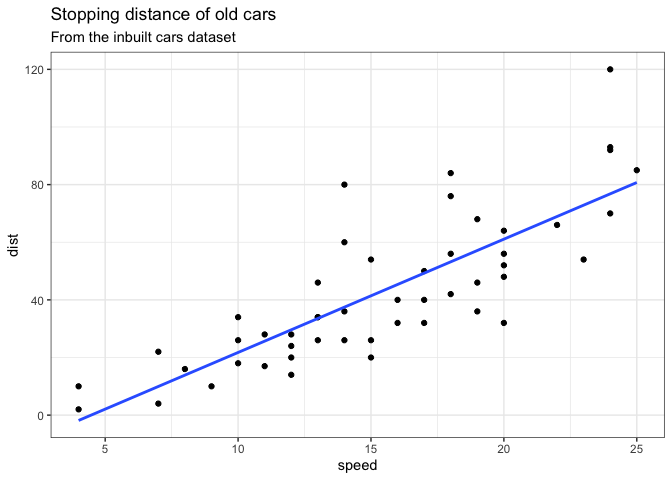
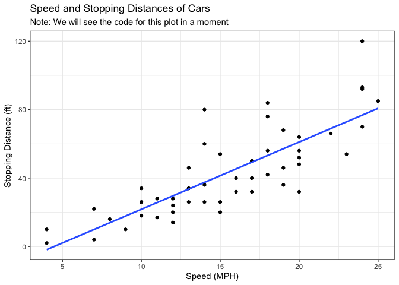
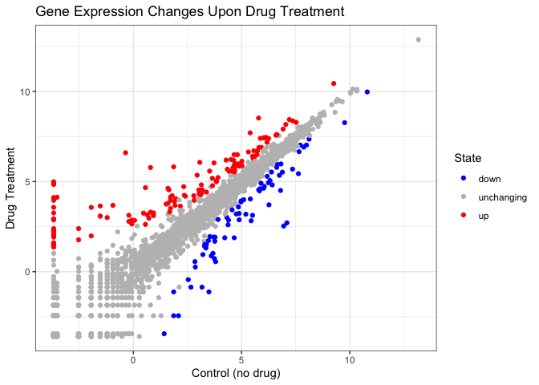
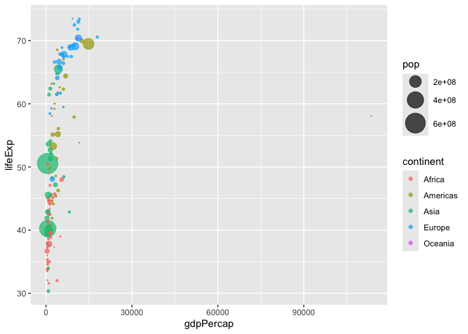
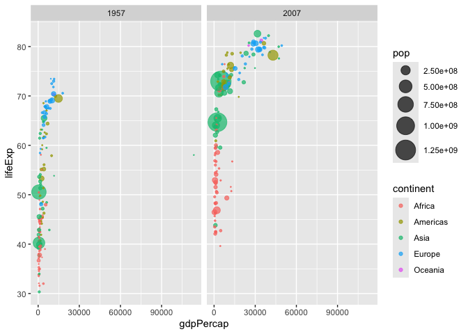
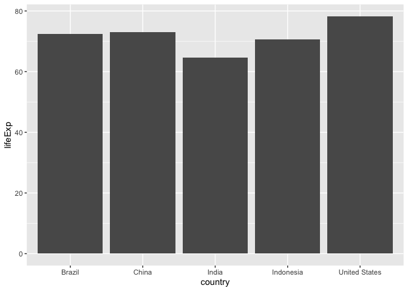
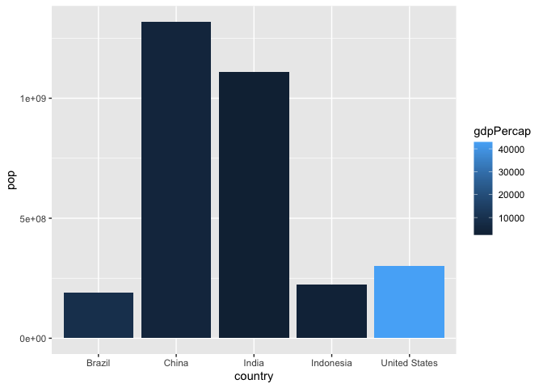

# Class 5: Data Viz with ggplot
Nathaniel Nono (PID: A16782656)

## Plotting in R

R has lots of ways to make plots and figures. This includes so-called
**base** graphics and packages like **ggplot2**.

``` r
plot(cars)
```


This is a **base** R plot of the in-build `cars` dataset that has only
two columns:

``` r
head(cars)
```

      speed dist
    1     4    2
    2     4   10
    3     7    4
    4     7   22
    5     8   16
    6     9   10

> Q. How would we plot this wee dataset with **ggplot2**?

All ggplot figures have at least 3 layers:

- **data**
- **aesthetics**(how the data map to the plot)
- **geoms**(how we draw the plot, lines, points, etc.)

Before I use any new package I need to download and install it with the
`install.packages()` command.

Never use the `install.packages()` within my quarto document otherwise I
will install the package over and over and over again - which is silly

There are hundreds of packages installed on the computer via R or
through the internet. Need to just call the package with a `library()`
command.

``` r
# install.packages('ggplot2')
library(ggplot2)
ggplot(cars) +
  aes(x=speed, y=dist) +
  geom_point()
```


**Key point**: For simple plots (like the one above) ggplot is more
verbose (we need to do more typing) but as plots get more complicated
ggplot starts to be more clear and simple than base R plot()

``` r
ggplot(cars) + 
  aes(speed, dist) +
  geom_point() + 
  geom_smooth(se=F, method='lm') + 
  labs(title='Stopping distance of old cars',
       subtitle = 'From the inbuilt cars dataset') + 
  theme_bw()
```

    `geom_smooth()` using formula = 'y ~ x'



## Running Code

When you click the **Render** button a document will be generated that
includes both content and the output of embedded code. You can embed
code like this:

``` r
1 + 1
```

    [1] 2

You can add options to executable code like this

    [1] 4

The `echo: false` option disables the printing of code (only output is
displayed).

# Class 5 Lab Section

## 5: Common Plot Types

### Others

> Q. Which plot types are typically NOT used to compare distributions of
> numeric variables?

**Network Graphs**

> Q. Which statement about data visualization with ggplot2 is incorrect?

**ggplot is the only way to create plots in R**

## 6: Creating Scatter Plots

### Introduction to Scatter plots

- Defining a dataset for your plot using the main `ggplot()` function.
- Specifying how your data maps to plot aesthetics with the `aes()`
  function.
- Adding geometric layers using the geom_point() function.
- Combining the above function calls with + operator to make your plot.

``` r
ggplot(cars) + 
  aes(speed, dist) +
  geom_point()
```


## Specificing a dataset mappings with `ggplot()`

- Plot using the in-built `cars` dataset -\> Does not display anything

``` r
ggplot(cars)
```


### Specificing aesthetic mappings with `aes()`

- Displays a x and y coordinate plane but datapoints

``` r
ggplot(cars) + 
  aes(x=speed, y=dist)
```


### Specificing a geom layer with `geom_point()`

- `geom_line()` -\> Produces a line plot
- `geom_bar()` -\> Produces a bar plot
- `geom_boxplot()` -\> Produces a box plot

``` r
ggplot(cars) + 
  aes(x=speed, y=dist) + 
  geom_point()
```


> Q. Which geometric layer should be used to create scatter plots in
> ggplot2?

**geom_point()**

> Q. In your own RStudio can you add a trend line layer to help show the
> relationship between the plot variables with the geom_smooth()
> function?

``` r
ggplot(cars) + 
  aes(x=speed, y=dist) + 
  geom_point() + 
  geom_smooth()
```

    `geom_smooth()` using method = 'loess' and formula = 'y ~ x'


> Q. Argue with geom_smooth() to add a straight line from a linear model
> without the shaded standard error region?

``` r
ggplot(cars) + 
  aes(x=speed, y=dist) + 
  geom_point() + 
  geom_smooth(se=F,method='lm')
```

    `geom_smooth()` using formula = 'y ~ x'


> Q. Can you finish this plot by adding various label annotations with
> the labs() function and changing the plot look to a more conservative
> “black & white” theme by adding the theme_bw() function:

``` r
ggplot(cars) + 
  aes(x=speed, y=dist) + 
  geom_point() + 
  geom_smooth(se=F,method='lm') + 
  labs(title = 'Speed and Stopping Distances of Cars',
       subtitle = 'Note: We will see the code for this plot in a moment',
       x = 'Speed (MPH)',
       y = 'Stopping Distance (ft)') + 
  theme_bw()
```

    `geom_smooth()` using formula = 'y ~ x'



### Adding more plot aesthetics through `aes()`

Here we will cover how to: - Adjust the point size of a scatter plot
using the `size` parameter. - Change the point color of a scatter plot
using the `color` parameter. - Set a parameter `alpha` to change the
transparency of all points.

- Aesthetic Mappings - plot features you want mapped to variables in
  your data
- Constant Parameters - Specifications of plot features you want to
  remain the same or therwise come from elsewhere

The code below reads the results of a differential expression analysis
where a new anti-viral drug is being tested:

``` r
url <- "https://bioboot.github.io/bimm143_S20/class-material/up_down_expression.txt"
genes <- read.delim(url)
head(genes)
```

            Gene Condition1 Condition2      State
    1      A4GNT -3.6808610 -3.4401355 unchanging
    2       AAAS  4.5479580  4.3864126 unchanging
    3      AASDH  3.7190695  3.4787276 unchanging
    4       AATF  5.0784720  5.0151916 unchanging
    5       AATK  0.4711421  0.5598642 unchanging
    6 AB015752.4 -3.6808610 -3.5921390 unchanging

> Q. Use the nrow() function to find out how many genes are in this
> dataset. What is your answer?

``` r
nrow(genes)
```

    [1] 5196

**5196 genes in the dataset**

> Q. Use the colnames() function and the ncol() function on the genes
> data frame to find out what the column names are (we will need these
> later) and how many columns there are. How many columns did you find?

``` r
colnames(genes)
```

    [1] "Gene"       "Condition1" "Condition2" "State"     

``` r
ncol(genes)
```

    [1] 4

**4 genes: ‘Gene’, ‘Condition1’, ‘Condition2’, ‘State’**

> Q. Use the table() function on the State column of this data.frame to
> find out how many ‘up’ regulated genes there are. What is your answer?

``` r
table(genes[,'State'])
```


          down unchanging         up 
            72       4997        127 

**127 upregulated genes in the dataset**

> Q. Using your values above and 2 significant figures. What fraction of
> total genes is up-regulated in this dataset?

``` r
# Fraction of up regulated genes
up_regulated <- table(genes$State)/nrow(genes)
up_regulated
```


          down unchanging         up 
    0.01385681 0.96170131 0.02444188 

``` r
# Percent of up regulated genes rounded to significant figures
fraction_regulated <- round((up_regulated * 100), 2)
fraction_regulated
```


          down unchanging         up 
          1.39      96.17       2.44 

**2.44% are regulated from the entire data set**

We can make a first basic scatter plot of this data set, by following
the same recipe we have already seen, namely:

- Pass the genes data.frame as input to the ggplot() function.
- Then use the aes() function to set the x and y aesthetic mappings to
  the Condition1 and Condition2 columns.
- Finally add a geom_point() layer to add points to the plot.
- Don’t forget to add layers step-wise with the + operator at the end of
  each line.

> Q. Complete the code below to produce the following plot

``` r
ggplot(genes) + 
  aes(x=Condition1, y=Condition2) + 
  geom_point()
```


Inclduing the State column tells us whether the difference in expression
values vetween codnitions is statistically signficant. Let’s map this
column to point colour

``` r
p <- ggplot(genes) + 
    aes(x=Condition1, y=Condition2, col=State) +
    geom_point()
p
```


Add more layers to the previous plot

``` r
p + scale_colour_manual( values=c("blue","gray","red") )
```


``` r
p
```


> Q. Nice, now add some plot annotations to the p object with the labs()
> function so your plot looks like the following:

``` r
p + theme_bw() + 
  scale_colour_manual( values=c("blue","gray","red") ) + 
  labs(title = 'Gene Expression Changes Upon Drug Treatment',
       x = 'Control (no drug)',
       y = 'Drug Treatment')
```



``` r
p
```


## 7: Going Further

After installing the `install.packages('gapminder')` call the function
in the console

``` r
library(gapminder)
```

Other option:

``` r
# File location online
url <- "https://raw.githubusercontent.com/jennybc/gapminder/master/inst/extdata/gapminder.tsv"

gapminder <- read.delim(url)
```

`dplyr` code used to focus in a single year. Need to isntall first then
call the function

``` r
# install.packages("dplyr")  ## un-comment to install if needed
library(dplyr)
```


    Attaching package: 'dplyr'

    The following objects are masked from 'package:stats':

        filter, lag

    The following objects are masked from 'package:base':

        intersect, setdiff, setequal, union

``` r
gapminder_2007 <- gapminder %>% filter(year==2007)
```

> Q. Complete the code below to produce a first basic scater plot of
> this gapminder_2007 dataset:

``` r
ggplot(gapminder_2007) +
  aes(x=gdpPercap, y=lifeExp) +
  geom_point()
```


Make the points more transparent with the `alpha` argument in the
`geom_point` layer

``` r
ggplot(gapminder_2007) +
  aes(x=gdpPercap, y=lifeExp) +
  geom_point(alpha=0.5)
```


### Adding more variable to `aes()`

- Map continent variable to the point color aesthetic
- Map population (in millions) through the point size argument to aes()

``` r
ggplot(gapminder_2007) +
  aes(x=gdpPercap, y=lifeExp, color=continent, size=pop) +
  geom_point(alpha=0.5)
```


- Coloring the points by the numeric variable population pop

``` r
ggplot(gapminder_2007) + 
  aes(x = gdpPercap, y = lifeExp, color = pop) +
  geom_point(alpha=0.8)
```


### Adjusting point size

- plot the GDP per capita vs the life expectanncy
- Set the point size base don the population of each country we can use

``` r
ggplot(gapminder_2007) + 
  aes(x = gdpPercap, y = lifeExp, size = pop) +
  geom_point(alpha=0.5)
```


- Reflect the actual population differnces by the point size we can use
  the scale_size_area() function

``` r
ggplot(gapminder_2007) + 
  geom_point(aes(x = gdpPercap, y = lifeExp,
                 size = pop), alpha=0.5) + 
  scale_size_area(max_size = 10)
```


> Can you adapt the code you have learned thus far to reproduce our
> gapminder scatter plot for the year 1957? What do you notice about
> this plot is it easy to compare with the one for 2007?

- Use dplyr to filter the gapmider dataset to include only the year 1957
  (check above for how we did this for 2007).
- Save your result as gapminder_1957.
- Use the ggplot() function and specify the gapminder_1957 dataset as
  input
- Add a geom_point() layer to the plot and create a scatter plot showing
  the GDP per capita gdpPercap on the x-axis and the life expectancy
  lifeExp on the y-axis
- Use the color aesthetic to indicate each continent by a different
  color
- Use the size aesthetic to adjust the point size by the population pop
- Use scale_size_area() so that the point sizes reflect the actual
  population differences and set the max_size of each point to 15 -Set
  the opacity/transparency of each point to 70% using the alpha=0.7
  parameter

``` r
gapminder_1957 <- gapminder %>% filter(year==1957)
ggplot(gapminder_1957) + 
  aes(x=gdpPercap, y=lifeExp, size=pop, color=continent) + 
  geom_point(alpha=0.7) + 
  scale_size_area(max_size = 10)
```



> Q. Do the same steps above but include 1957 and 2007 in your input
> dataset for ggplot(). You should now include the layer
> facet_wrap(~year) to produce the following plot:

``` r
gapminder_1957 <- gapminder %>% filter(year==1957 | year ==2007)
ggplot(gapminder_1957) + 
  aes(x=gdpPercap, y=lifeExp, size=pop, color=continent) + 
  geom_point(alpha=0.7) + 
  scale_size_area(max_size = 10) + 
  facet_wrap(~year)
```



## Lab Section: Ireland

> Q. How many years are in this dataset?

``` r
length(gapminder$year)
```

    [1] 1704

Still does not say how many years there are because there includes
duplicates

``` r
table(gapminder$year)
```


    1952 1957 1962 1967 1972 1977 1982 1987 1992 1997 2002 2007 
     142  142  142  142  142  142  142  142  142  142  142  142 

142 entries per year but still doesn’t answer how many years there are

``` r
length(unique(gapminder$year))
```

    [1] 12

`length(unique(gapminder$year))` Shows the length of unique years there
are

``` r
library(dplyr)
```

> Q. Extract data fro the US in 1992

``` r
filter(gapminder, country=='United States', 
       year==1992)
```

            country continent year lifeExp       pop gdpPercap
    1 United States  Americas 1992   76.09 256894189  32003.93

> Q. What was the population of Ireland in the last year we have data
> for?

``` r
filter(gapminder, country=='Ireland',
       year==2007)
```

      country continent year lifeExp     pop gdpPercap
    1 Ireland    Europe 2007  78.885 4109086     40676

The population of Ireland in the last year we have data for which was
2007 is 40676

> Q. What countries in the dataset have a population smaller than
> Ireland in 2007?

- First limit/subset the dataset to the year 2007

``` r
filter(gapminder, year == 2007)
```

                         country continent year lifeExp        pop  gdpPercap
    1                Afghanistan      Asia 2007  43.828   31889923   974.5803
    2                    Albania    Europe 2007  76.423    3600523  5937.0295
    3                    Algeria    Africa 2007  72.301   33333216  6223.3675
    4                     Angola    Africa 2007  42.731   12420476  4797.2313
    5                  Argentina  Americas 2007  75.320   40301927 12779.3796
    6                  Australia   Oceania 2007  81.235   20434176 34435.3674
    7                    Austria    Europe 2007  79.829    8199783 36126.4927
    8                    Bahrain      Asia 2007  75.635     708573 29796.0483
    9                 Bangladesh      Asia 2007  64.062  150448339  1391.2538
    10                   Belgium    Europe 2007  79.441   10392226 33692.6051
    11                     Benin    Africa 2007  56.728    8078314  1441.2849
    12                   Bolivia  Americas 2007  65.554    9119152  3822.1371
    13    Bosnia and Herzegovina    Europe 2007  74.852    4552198  7446.2988
    14                  Botswana    Africa 2007  50.728    1639131 12569.8518
    15                    Brazil  Americas 2007  72.390  190010647  9065.8008
    16                  Bulgaria    Europe 2007  73.005    7322858 10680.7928
    17              Burkina Faso    Africa 2007  52.295   14326203  1217.0330
    18                   Burundi    Africa 2007  49.580    8390505   430.0707
    19                  Cambodia      Asia 2007  59.723   14131858  1713.7787
    20                  Cameroon    Africa 2007  50.430   17696293  2042.0952
    21                    Canada  Americas 2007  80.653   33390141 36319.2350
    22  Central African Republic    Africa 2007  44.741    4369038   706.0165
    23                      Chad    Africa 2007  50.651   10238807  1704.0637
    24                     Chile  Americas 2007  78.553   16284741 13171.6388
    25                     China      Asia 2007  72.961 1318683096  4959.1149
    26                  Colombia  Americas 2007  72.889   44227550  7006.5804
    27                   Comoros    Africa 2007  65.152     710960   986.1479
    28          Congo, Dem. Rep.    Africa 2007  46.462   64606759   277.5519
    29               Congo, Rep.    Africa 2007  55.322    3800610  3632.5578
    30                Costa Rica  Americas 2007  78.782    4133884  9645.0614
    31             Cote d'Ivoire    Africa 2007  48.328   18013409  1544.7501
    32                   Croatia    Europe 2007  75.748    4493312 14619.2227
    33                      Cuba  Americas 2007  78.273   11416987  8948.1029
    34            Czech Republic    Europe 2007  76.486   10228744 22833.3085
    35                   Denmark    Europe 2007  78.332    5468120 35278.4187
    36                  Djibouti    Africa 2007  54.791     496374  2082.4816
    37        Dominican Republic  Americas 2007  72.235    9319622  6025.3748
    38                   Ecuador  Americas 2007  74.994   13755680  6873.2623
    39                     Egypt    Africa 2007  71.338   80264543  5581.1810
    40               El Salvador  Americas 2007  71.878    6939688  5728.3535
    41         Equatorial Guinea    Africa 2007  51.579     551201 12154.0897
    42                   Eritrea    Africa 2007  58.040    4906585   641.3695
    43                  Ethiopia    Africa 2007  52.947   76511887   690.8056
    44                   Finland    Europe 2007  79.313    5238460 33207.0844
    45                    France    Europe 2007  80.657   61083916 30470.0167
    46                     Gabon    Africa 2007  56.735    1454867 13206.4845
    47                    Gambia    Africa 2007  59.448    1688359   752.7497
    48                   Germany    Europe 2007  79.406   82400996 32170.3744
    49                     Ghana    Africa 2007  60.022   22873338  1327.6089
    50                    Greece    Europe 2007  79.483   10706290 27538.4119
    51                 Guatemala  Americas 2007  70.259   12572928  5186.0500
    52                    Guinea    Africa 2007  56.007    9947814   942.6542
    53             Guinea-Bissau    Africa 2007  46.388    1472041   579.2317
    54                     Haiti  Americas 2007  60.916    8502814  1201.6372
    55                  Honduras  Americas 2007  70.198    7483763  3548.3308
    56          Hong Kong, China      Asia 2007  82.208    6980412 39724.9787
    57                   Hungary    Europe 2007  73.338    9956108 18008.9444
    58                   Iceland    Europe 2007  81.757     301931 36180.7892
    59                     India      Asia 2007  64.698 1110396331  2452.2104
    60                 Indonesia      Asia 2007  70.650  223547000  3540.6516
    61                      Iran      Asia 2007  70.964   69453570 11605.7145
    62                      Iraq      Asia 2007  59.545   27499638  4471.0619
    63                   Ireland    Europe 2007  78.885    4109086 40675.9964
    64                    Israel      Asia 2007  80.745    6426679 25523.2771
    65                     Italy    Europe 2007  80.546   58147733 28569.7197
    66                   Jamaica  Americas 2007  72.567    2780132  7320.8803
    67                     Japan      Asia 2007  82.603  127467972 31656.0681
    68                    Jordan      Asia 2007  72.535    6053193  4519.4612
    69                     Kenya    Africa 2007  54.110   35610177  1463.2493
    70          Korea, Dem. Rep.      Asia 2007  67.297   23301725  1593.0655
    71               Korea, Rep.      Asia 2007  78.623   49044790 23348.1397
    72                    Kuwait      Asia 2007  77.588    2505559 47306.9898
    73                   Lebanon      Asia 2007  71.993    3921278 10461.0587
    74                   Lesotho    Africa 2007  42.592    2012649  1569.3314
    75                   Liberia    Africa 2007  45.678    3193942   414.5073
    76                     Libya    Africa 2007  73.952    6036914 12057.4993
    77                Madagascar    Africa 2007  59.443   19167654  1044.7701
    78                    Malawi    Africa 2007  48.303   13327079   759.3499
    79                  Malaysia      Asia 2007  74.241   24821286 12451.6558
    80                      Mali    Africa 2007  54.467   12031795  1042.5816
    81                Mauritania    Africa 2007  64.164    3270065  1803.1515
    82                 Mauritius    Africa 2007  72.801    1250882 10956.9911
    83                    Mexico  Americas 2007  76.195  108700891 11977.5750
    84                  Mongolia      Asia 2007  66.803    2874127  3095.7723
    85                Montenegro    Europe 2007  74.543     684736  9253.8961
    86                   Morocco    Africa 2007  71.164   33757175  3820.1752
    87                Mozambique    Africa 2007  42.082   19951656   823.6856
    88                   Myanmar      Asia 2007  62.069   47761980   944.0000
    89                   Namibia    Africa 2007  52.906    2055080  4811.0604
    90                     Nepal      Asia 2007  63.785   28901790  1091.3598
    91               Netherlands    Europe 2007  79.762   16570613 36797.9333
    92               New Zealand   Oceania 2007  80.204    4115771 25185.0091
    93                 Nicaragua  Americas 2007  72.899    5675356  2749.3210
    94                     Niger    Africa 2007  56.867   12894865   619.6769
    95                   Nigeria    Africa 2007  46.859  135031164  2013.9773
    96                    Norway    Europe 2007  80.196    4627926 49357.1902
    97                      Oman      Asia 2007  75.640    3204897 22316.1929
    98                  Pakistan      Asia 2007  65.483  169270617  2605.9476
    99                    Panama  Americas 2007  75.537    3242173  9809.1856
    100                 Paraguay  Americas 2007  71.752    6667147  4172.8385
    101                     Peru  Americas 2007  71.421   28674757  7408.9056
    102              Philippines      Asia 2007  71.688   91077287  3190.4810
    103                   Poland    Europe 2007  75.563   38518241 15389.9247
    104                 Portugal    Europe 2007  78.098   10642836 20509.6478
    105              Puerto Rico  Americas 2007  78.746    3942491 19328.7090
    106                  Reunion    Africa 2007  76.442     798094  7670.1226
    107                  Romania    Europe 2007  72.476   22276056 10808.4756
    108                   Rwanda    Africa 2007  46.242    8860588   863.0885
    109    Sao Tome and Principe    Africa 2007  65.528     199579  1598.4351
    110             Saudi Arabia      Asia 2007  72.777   27601038 21654.8319
    111                  Senegal    Africa 2007  63.062   12267493  1712.4721
    112                   Serbia    Europe 2007  74.002   10150265  9786.5347
    113             Sierra Leone    Africa 2007  42.568    6144562   862.5408
    114                Singapore      Asia 2007  79.972    4553009 47143.1796
    115          Slovak Republic    Europe 2007  74.663    5447502 18678.3144
    116                 Slovenia    Europe 2007  77.926    2009245 25768.2576
    117                  Somalia    Africa 2007  48.159    9118773   926.1411
    118             South Africa    Africa 2007  49.339   43997828  9269.6578
    119                    Spain    Europe 2007  80.941   40448191 28821.0637
    120                Sri Lanka      Asia 2007  72.396   20378239  3970.0954
    121                    Sudan    Africa 2007  58.556   42292929  2602.3950
    122                Swaziland    Africa 2007  39.613    1133066  4513.4806
    123                   Sweden    Europe 2007  80.884    9031088 33859.7484
    124              Switzerland    Europe 2007  81.701    7554661 37506.4191
    125                    Syria      Asia 2007  74.143   19314747  4184.5481
    126                   Taiwan      Asia 2007  78.400   23174294 28718.2768
    127                 Tanzania    Africa 2007  52.517   38139640  1107.4822
    128                 Thailand      Asia 2007  70.616   65068149  7458.3963
    129                     Togo    Africa 2007  58.420    5701579   882.9699
    130      Trinidad and Tobago  Americas 2007  69.819    1056608 18008.5092
    131                  Tunisia    Africa 2007  73.923   10276158  7092.9230
    132                   Turkey    Europe 2007  71.777   71158647  8458.2764
    133                   Uganda    Africa 2007  51.542   29170398  1056.3801
    134           United Kingdom    Europe 2007  79.425   60776238 33203.2613
    135            United States  Americas 2007  78.242  301139947 42951.6531
    136                  Uruguay  Americas 2007  76.384    3447496 10611.4630
    137                Venezuela  Americas 2007  73.747   26084662 11415.8057
    138                  Vietnam      Asia 2007  74.249   85262356  2441.5764
    139       West Bank and Gaza      Asia 2007  73.422    4018332  3025.3498
    140              Yemen, Rep.      Asia 2007  62.698   22211743  2280.7699
    141                   Zambia    Africa 2007  42.384   11746035  1271.2116
    142                 Zimbabwe    Africa 2007  43.487   12311143   469.7093

- Then find the `pop` for value for Ireland

``` r
ireland_2007 <- filter(gapminder, country=='Ireland',
                       year == 2007)
ireland_2007
```

      country continent year lifeExp     pop gdpPercap
    1 Ireland    Europe 2007  78.885 4109086     40676

``` r
ireland_2007_pop <- ireland_2007['pop']
ireland_2007_pop
```

          pop
    1 4109086

- Then extract all rows with `pop` less than Ireland

``` r
filter(filter(gapminder, year == 2007), pop<4109086)
```

                     country continent year lifeExp     pop  gdpPercap
    1                Albania    Europe 2007  76.423 3600523  5937.0295
    2                Bahrain      Asia 2007  75.635  708573 29796.0483
    3               Botswana    Africa 2007  50.728 1639131 12569.8518
    4                Comoros    Africa 2007  65.152  710960   986.1479
    5            Congo, Rep.    Africa 2007  55.322 3800610  3632.5578
    6               Djibouti    Africa 2007  54.791  496374  2082.4816
    7      Equatorial Guinea    Africa 2007  51.579  551201 12154.0897
    8                  Gabon    Africa 2007  56.735 1454867 13206.4845
    9                 Gambia    Africa 2007  59.448 1688359   752.7497
    10         Guinea-Bissau    Africa 2007  46.388 1472041   579.2317
    11               Iceland    Europe 2007  81.757  301931 36180.7892
    12               Jamaica  Americas 2007  72.567 2780132  7320.8803
    13                Kuwait      Asia 2007  77.588 2505559 47306.9898
    14               Lebanon      Asia 2007  71.993 3921278 10461.0587
    15               Lesotho    Africa 2007  42.592 2012649  1569.3314
    16               Liberia    Africa 2007  45.678 3193942   414.5073
    17            Mauritania    Africa 2007  64.164 3270065  1803.1515
    18             Mauritius    Africa 2007  72.801 1250882 10956.9911
    19              Mongolia      Asia 2007  66.803 2874127  3095.7723
    20            Montenegro    Europe 2007  74.543  684736  9253.8961
    21               Namibia    Africa 2007  52.906 2055080  4811.0604
    22                  Oman      Asia 2007  75.640 3204897 22316.1929
    23                Panama  Americas 2007  75.537 3242173  9809.1856
    24           Puerto Rico  Americas 2007  78.746 3942491 19328.7090
    25               Reunion    Africa 2007  76.442  798094  7670.1226
    26 Sao Tome and Principe    Africa 2007  65.528  199579  1598.4351
    27              Slovenia    Europe 2007  77.926 2009245 25768.2576
    28             Swaziland    Africa 2007  39.613 1133066  4513.4806
    29   Trinidad and Tobago  Americas 2007  69.819 1056608 18008.5092
    30               Uruguay  Americas 2007  76.384 3447496 10611.4630
    31    West Bank and Gaza      Asia 2007  73.422 4018332  3025.3498

``` r
nrow(filter(filter(gapminder, year == 2007), pop<4109086))
```

    [1] 31

## OPTIONAL: Bar Charts

### Introduction to Bar Charts

- Bar charts are well suited to compare values among different groups
- Below shows the number of people (in millions) in the five biggest
  countries by population in 2007

``` r
gapminder_top5 <- gapminder %>% 
  filter(year==2007) %>% 
  arrange(desc(pop)) %>% 
  top_n(5, pop)

gapminder_top5
```

            country continent year lifeExp        pop gdpPercap
    1         China      Asia 2007  72.961 1318683096  4959.115
    2         India      Asia 2007  64.698 1110396331  2452.210
    3 United States  Americas 2007  78.242  301139947 42951.653
    4     Indonesia      Asia 2007  70.650  223547000  3540.652
    5        Brazil  Americas 2007  72.390  190010647  9065.801

### Creating a simple bar chart

- Bar charts are created using the `geom_col()` geometric layer
- Create a bar chart with the gapminder_top5 dataset. It contains
  population (in millions) and life expectancy data for the biggest
  countries by population in 2007.

``` r
ggplot(gapminder_top5) + 
  geom_col(aes(x = country, y = pop))
```


> Create a bar chart showing the life expectancy of the five biggest
> countries by population in 2007.

``` r
ggplot(gapminder_top5) + 
  geom_col(aes(x = country, y = lifeExp))
```



### Filling bars with color

``` r
ggplot(gapminder_top5) + 
  geom_col(aes(x = country, y = pop, fill = continent))
```


``` r
ggplot(gapminder_top5) + 
  geom_col(aes(x = country, y = pop, fill = lifeExp))
```


> Q. Plot population size by country. Create a bar chart showing the
> population (in millions) of the five biggest countries by population
> in 2007.

- Use the ggplot() function and specify the gapminder_top5 dataset as
  input
- Add a geom_col() layer to the plot
- Plot one bar for each country (x aesthetic)
- Use population pop as bar height (y aesthetic)
- Use the GDP per capita gdpPercap as fill aesthetic

``` r
ggplot(gapminder_top5) +
  aes(x=country, y=pop, fill=gdpPercap) +
  geom_col()
```



``` r
ggplot(gapminder_top5) +
  aes(x=reorder(country, -pop), y=pop, fill=gdpPercap) +
  geom_col()
```


``` r
ggplot(gapminder_top5) +
  aes(x=reorder(country, -pop), y=pop, fill=country) +
  geom_col(col="gray30") +
  guides(fill="none")
```


### Flipping bar charts

``` r
head(USArrests)
```

               Murder Assault UrbanPop Rape
    Alabama      13.2     236       58 21.2
    Alaska       10.0     263       48 44.5
    Arizona       8.1     294       80 31.0
    Arkansas      8.8     190       50 19.5
    California    9.0     276       91 40.6
    Colorado      7.9     204       78 38.7

``` r
USArrests$State <- rownames(USArrests)
ggplot(USArrests) +
  aes(x=reorder(State,Murder), y=Murder) +
  geom_col() +
  coord_flip()
```


``` r
ggplot(USArrests) +
  aes(x=reorder(State,Murder), y=Murder) +
  geom_point() +
  geom_segment(aes(x=State, 
                   xend=State, 
                   y=0, 
                   yend=Murder), color="blue") +
  coord_flip()
```


