# Class 7: Machine Learning I
Nathaniel Nono (PID: A16782656)

Today we are going to leanr how to apply different machine learning
methods

# In-Class Section

## Clustering

The goal here is to find groups/clusters in your data

`rnorm` function:

- Description: Density, distribution function, quantile function and
  random generation for the normal distribution with mean equal to mean
  and standard deviation equal to sd.

- Arguments:

`n` = number of observations. If length(n) \> 1, the length is taken to
be the number required

`mean` = vector of means

`sd` = vector of standard deviations

First I will make up some data with clear groups using the `rnorm`
function

``` r
# 10 points of data
rnorm(10)
```

     [1] -0.98023652  0.04214476 -0.12495577  1.40182712 -0.43036516 -0.28355517
     [7]  0.64036340  0.57169663  0.02431482  2.51147239

``` r
#10,000 points of data and turning it into a histogram
hist(rnorm(10000))
```

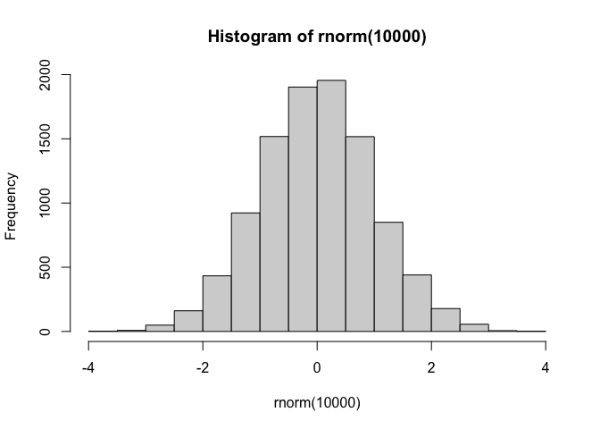

``` r
# Changing the center of the distribution to +3
hist(rnorm(10000, mean=3))
```

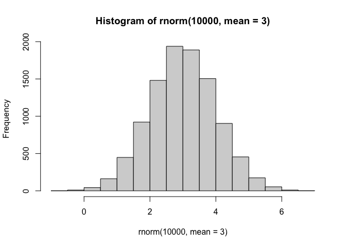

Make a vector with two peaks - Peak one = -3 - Peak two = +3

``` r
group_1 <- rnorm(10000, mean=-3)
group_2 <- rnorm(10000, mean=3)
hist(c(group_1, group_2))
```

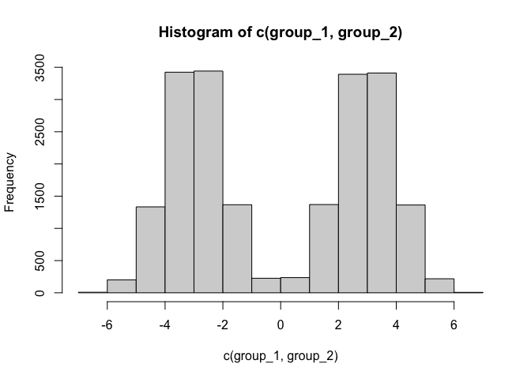

``` r
# Alternative code (Uncheck to use):
# n <- 10000
# x <- c(rnorm(n, -3), rnorm(n, +3))
# hist(x)
```

``` r
n <- 30
x <- c(rnorm(n, -3), rnorm(n, +3))
hist(x)
```

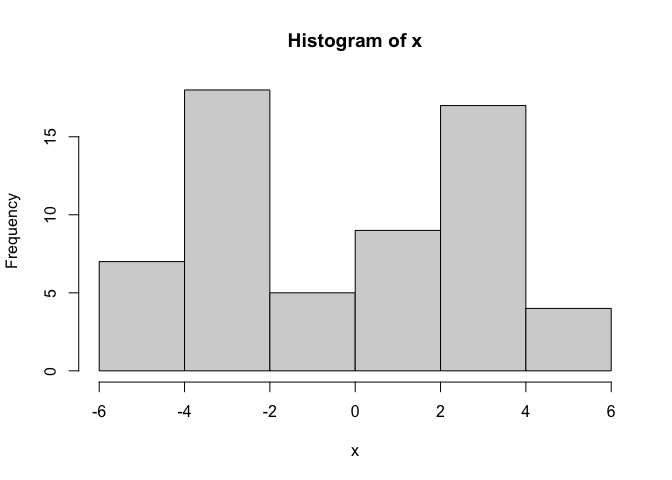

``` r
x
```

     [1] -3.6475254 -3.7122990 -4.6357995 -0.9687201 -3.2318569 -3.4464489
     [7] -2.2113972 -1.8500185 -3.9841365 -2.1481818 -2.6478712 -3.7303169
    [13] -2.5207555 -3.1025000 -3.9253841 -1.7975049 -4.1215752 -4.5794930
    [19] -3.8968735 -4.3253646 -4.6478921 -2.1937563 -1.7793423 -4.0401298
    [25] -2.2367938 -4.5447918 -3.4960377 -2.9141582 -2.9333146 -1.2751245
    [31]  2.5812356  4.2195564  5.4489816  3.3730444  2.5124886  2.4870042
    [37]  2.2942284  2.1765390  3.8267824  1.5185059  1.2413255  4.0462687
    [43]  3.4459664  3.1975981  1.7681485  0.9283637  0.8801723  3.7292208
    [49]  1.9201052  1.7395350  2.3784266  3.1225090  1.9958669  3.5302422
    [55]  2.4751037  1.7676540  3.6355829  2.7536646  4.4046861  3.0395126

``` r
n <- 30
x <- c(rnorm(n, -3), rnorm(n, +3))
# Reverses version of its argument
y <- rev(x)

# Takes the x and y coordinates and 
z <- cbind(x, y)
head(z)
```

                 x        y
    [1,] -2.774178 4.289524
    [2,] -3.852036 1.492637
    [3,] -2.692569 3.061644
    [4,] -2.434760 3.490254
    [5,] -4.185230 2.003800
    [6,] -2.316091 3.425479

``` r
plot(z)
```

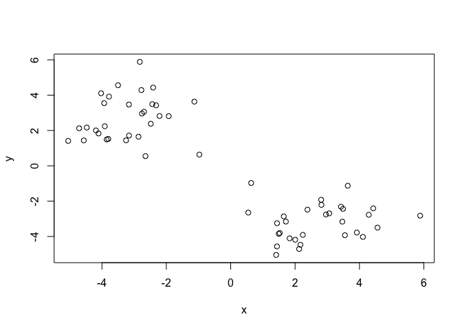

## K-Means

Use the `kmeans()` function setting k to 2 and nstart=20

Inspect/print the results

> Q. How many points are in each cluster?

> Q. What component of your result object details - Cluster size? -
> Cluster assignment/member - Cluster center?

> Q. Plot z colored by the kmeans colored by the kmeans cluster
> assignment and cluster centers as blue points

Tip: Use `?kmenas` to enter the help page. Focus on the arguments that
do not have defaults - x = numeric matrix of data, or an object that can
be coerced to such a matrix (such as a numeric vector or a data frame
with all numeric columns).

      - centers = either the number of clusters, say 𝑘, or a set of initial                    (distinct) cluster centres. If a number, a random set of                      (distinct) rows in x is chosen as the initial centres.
      

``` r
km <- kmeans(z, centers = 2)
km
```

    K-means clustering with 2 clusters of sizes 30, 30

    Cluster means:
              x         y
    1  2.700285 -3.196269
    2 -3.196269  2.700285

    Clustering vector:
     [1] 2 2 2 2 2 2 2 2 2 2 2 2 2 2 2 2 2 2 2 2 2 2 2 2 2 2 2 2 2 2 1 1 1 1 1 1 1 1
    [39] 1 1 1 1 1 1 1 1 1 1 1 1 1 1 1 1 1 1 1 1 1 1

    Within cluster sum of squares by cluster:
    [1] 76.42445 76.42445
     (between_SS / total_SS =  87.2 %)

    Available components:

    [1] "cluster"      "centers"      "totss"        "withinss"     "tot.withinss"
    [6] "betweenss"    "size"         "iter"         "ifault"      

- Cluster means - Shows the means of each cluster. Shows how close each
  point is to the center

- **Cluster vector** - Shows how many points are in each cluster

- Sum of squares by cluster - Shows how “good” the kmenas are (i think)

Available components; Results in kmeans object `km`

``` r
attributes(km)
```

    $names
    [1] "cluster"      "centers"      "totss"        "withinss"     "tot.withinss"
    [6] "betweenss"    "size"         "iter"         "ifault"      

    $class
    [1] "kmeans"

> What is the cluster size?

``` r
km$size
```

    [1] 30 30

> Cluster assignment/membership?

``` r
km$cluster
```

     [1] 2 2 2 2 2 2 2 2 2 2 2 2 2 2 2 2 2 2 2 2 2 2 2 2 2 2 2 2 2 2 1 1 1 1 1 1 1 1
    [39] 1 1 1 1 1 1 1 1 1 1 1 1 1 1 1 1 1 1 1 1 1 1

> Cluster center

``` r
km$centers
```

              x         y
    1  2.700285 -3.196269
    2 -3.196269  2.700285

> Q. Plot z colored by the kmeans colored by the kmeans cluster
> assignment and cluster centers as blue points

Remember, R will re-cycle the shorter color vector to be the same length
as the longer (number of data points) in z

``` r
plot(z, col=km$cluster)
points(km$centers, col='blue', pch=15, cex=3)
```

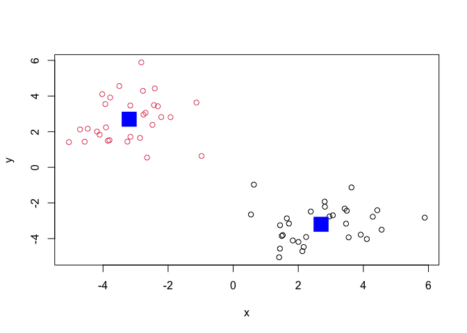

> Q. Can you run kmeans and ask for 4 cluster please and plot the
> results like we have done above? -\> Problem because there is a lot of
> uncertainty

``` r
km4 <- kmeans(z, centers=4)
plot(z, col=km4$cluster)
points(km4$centers, col='blue', pch=15, cex=3)
```

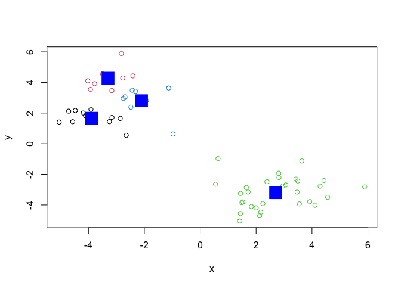

> How do you solve this problem?

- Scree plot - Systematically trying a range of different k values then
  finding the elbow point (The biggest seperation)

## Hierarchical Clustering

Bottom up cluster - Starting up from the bottom then making a cluster at
the top.

Let’s take our same made-up data `z` and see how hclust works.

`hclust()` function needs a distance matrix

``` r
d <- dist(z)
#d

hc <- hclust(d)
hc
```


    Call:
    hclust(d = d)

    Cluster method   : complete 
    Distance         : euclidean 
    Number of objects: 60 

Plotting the cluster dendrogram to show similarity

``` r
plot(hc)
abline(h=8, col='red')
```

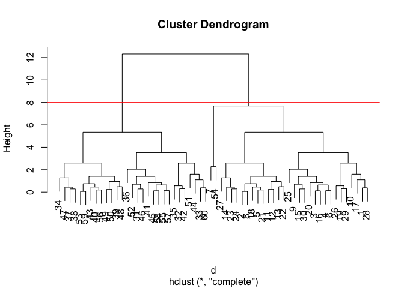

I can get my cluster membership vector by “cutting the tree” with the
`cutree()` function like so. This will give us our clusters:

``` r
grps2 <- cutree(hc, h=8)
grps2
```

     [1] 1 1 1 1 1 1 1 1 1 1 1 1 1 1 1 1 1 1 1 1 1 1 1 1 1 1 1 1 1 1 2 2 2 2 2 2 2 2
    [39] 2 2 2 2 2 2 2 2 2 2 2 2 2 2 2 1 2 2 2 2 2 2

> Can you plot `z` colored by our hclust results:

``` r
plot(z, col=grps2)
```

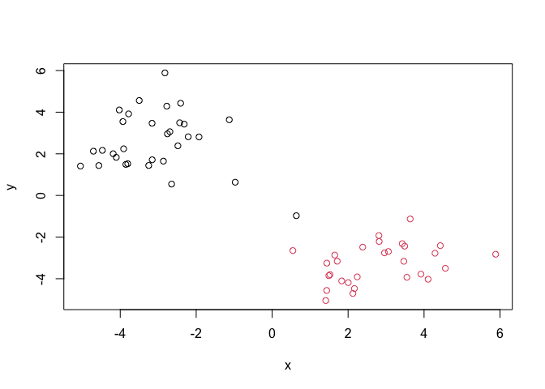

``` r
plot(hc)
abline(h=4.3, col='red')
```

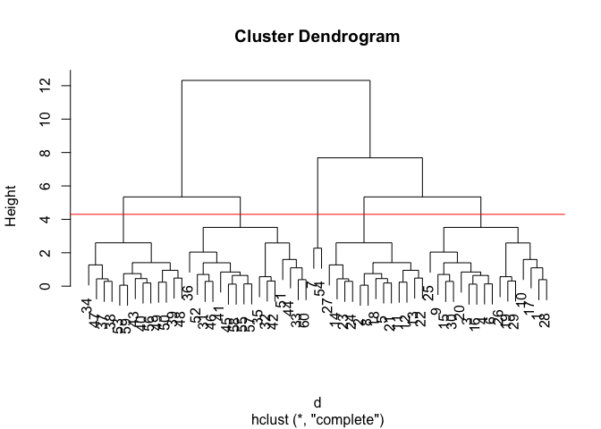

``` r
grps4 <- cutree(hc, h=4.3)
grps4
```

     [1] 1 2 1 1 2 1 3 2 1 1 2 2 2 2 1 1 1 2 1 1 2 2 2 2 1 1 2 1 1 1 4 4 4 5 4 4 5 5
    [39] 5 5 4 4 5 4 4 4 5 5 5 5 4 4 5 3 4 5 4 4 5 4

``` r
plot(z, col=grps4)
```

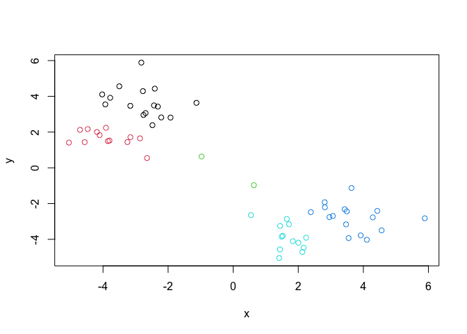

## Principtal Component Analysis (PCA)

Finding the dimensionaly reduction, visualization, and ‘structure’
analysis

Seen on the lab website

# Lab Section

## PCA of UK food data

> Q1. How many rows and columns are in your new data frame named x? What
> R functions could you use to answer this questions?

Read data from the UK on food consumption in different parts of the UK

``` r
url <- "https://tinyurl.com/UK-foods"
x <- read.csv(url, row.names=1)

head(x)
```

                   England Wales Scotland N.Ireland
    Cheese             105   103      103        66
    Carcass_meat       245   227      242       267
    Other_meat         685   803      750       586
    Fish               147   160      122        93
    Fats_and_oils      193   235      184       209
    Sugars             156   175      147       139

``` r
barplot(as.matrix(x), beside=T, col=rainbow(nrow(x)))
```


``` r
# beside = F; Stacked bar chart (More useless)
barplot(as.matrix(x), beside=F, col=rainbow(nrow(x)))
```


A so-called “Pairs” plot can be useful for small datasets like this one

``` r
pairs(x, col=rainbow(10), pch=16)
```


It’s hard to see structure and trends in even this small data set. How
will we ever do this when we have big data sets with 1,000s or 10s of
thousands of things we are measuring…

### PCA to the Rescue

The main function in base R to do PCA is called `prcomp()`

``` r
# transposing the values and performing a pca on it
pca <- prcomp(t(x))
summary(pca)
```

    Importance of components:
                                PC1      PC2      PC3       PC4
    Standard deviation     324.1502 212.7478 73.87622 2.921e-14
    Proportion of Variance   0.6744   0.2905  0.03503 0.000e+00
    Cumulative Proportion    0.6744   0.9650  1.00000 1.000e+00

- PC1: Captures 67.44% of the data

Let’s see what is inside this `pca` object that we created from running
`prcomp()`

``` r
attributes(pca)
```

    $names
    [1] "sdev"     "rotation" "center"   "scale"    "x"       

    $class
    [1] "prcomp"

``` r
pca$x
```

                     PC1         PC2        PC3           PC4
    England   -144.99315   -2.532999 105.768945 -9.152022e-15
    Wales     -240.52915 -224.646925 -56.475555  5.560040e-13
    Scotland   -91.86934  286.081786 -44.415495 -6.638419e-13
    N.Ireland  477.39164  -58.901862  -4.877895  1.329771e-13

Want to get the first two columns and plot them against each other

``` r
plot(pca$x[,1], pca$x[,2], xlab="PC1 (67.4%)", ylab="PC2 (29.0%)", xlim=c(-270,500))
text(pca$x[,1], pca$x[,2], colnames(x), col=c('black', 'red', 'blue', 'darkgreen'))
```

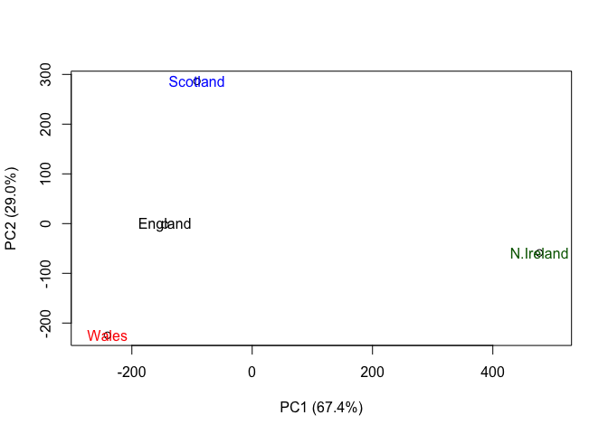

``` r
## Lets focus on PC1 as it accounts for > 90% of variance 
par(mar=c(10, 3, 0.35, 0))
barplot( pca$rotation[,1], las=2 )
```


